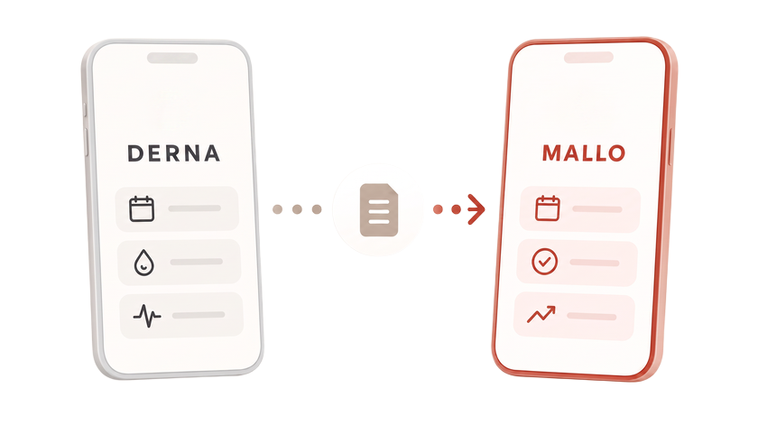
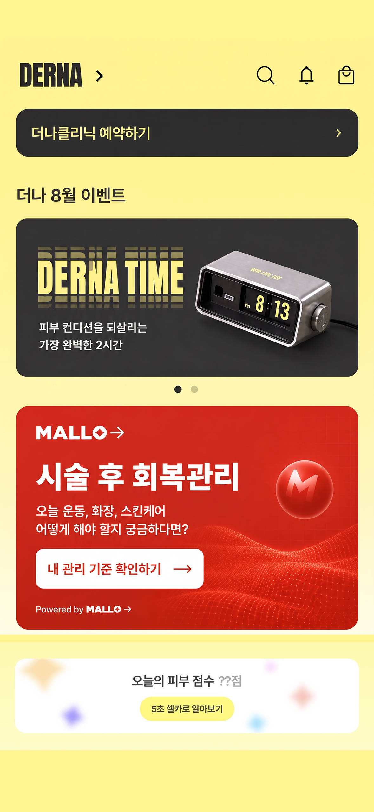
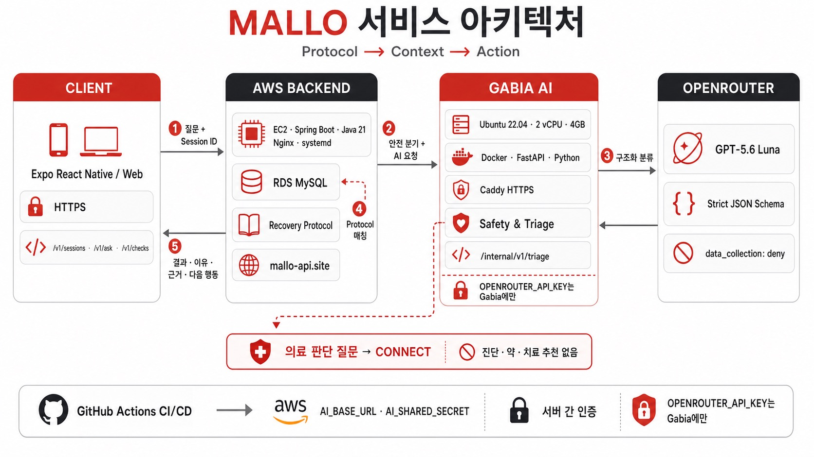

<div align="center">

# MALLO

### 시술 후 오늘, 무엇을 해도 되는지 60초 안에.

**시술 정보와 경과일을 이해하고, 오늘의 행동을 근거와 함께 안내하는 AI Recovery Companion**

멋쟁이사자처럼 14기 중앙 해커톤 · **AAC Wellness with AI Track**

🚀 서비스 체험하기 *(준비 중)* · ▶️ 2분 데모 영상 *(준비 중)* · [🛠️ Swagger](https://mallo-api.site/swagger-ui/index.html) · 📑 발표 자료 *(준비 중)*

<!-- 링크가 준비되면 위 줄을 아래 줄로 교체하세요.
[🚀 서비스 체험하기](FRONTEND_URL) · [▶️ 2분 데모 영상](YOUTUBE_URL) · [🛠️ Swagger](https://mallo-api.site/swagger-ui/index.html) · [📑 발표 자료](IR_DECK_URL)
-->

<br />



</div>

---

## 💡 Problem — 시술은 끝났지만, 회복은 이제 시작됩니다

병원에서 받은 안내문은 일회성이고, 웹 검색은 **내 시술과 오늘의 경과일**을 알지 못합니다.

사용자는 회복 기간 내내 같은 고민을 반복합니다.

> “리쥬란 맞고 오늘 화장해도 될까?”
>
> “운동은 언제부터, 어느 강도로 가능할까?”
>
> “레티놀이나 스크럽 제품을 다시 써도 될까?”

범용 생성형 AI에 묻기에는 의료 정보가 부정확하게 생성될 위험이 있고, 사소한 생활 질문까지 매번 병원에 문의하기도 어렵습니다.

MALLO는 이 간극을 **시술 정보 × 경과일 × 행동 조건**에 기반한 Recovery Journey로 연결합니다.

<!-- 사용자 인터뷰/설문 수치가 확보되면 아래 블록의 주석을 해제하고 실제 값으로 교체하세요.

### 우리가 확인한 문제

| 사용자 검증 | 결과 |
| --- | ---: |
| 인터뷰·설문 참여자 | **00명** |
| 시술 후 추가 검색 경험 | **00%** |
| 안내문만으로 행동 판단이 어려웠던 사용자 | **00%** |
| 가장 많이 반복된 질문 | **세안 · 화장 · 운동** |

> “실제 인터뷰에서 나온 한 문장 인용을 여기에 입력하세요.”

-->

## Solution — 질문 하나가 오늘의 행동이 되도록

| 기존 방식 | MALLO |
| --- | --- |
| 안내문을 다시 찾아 읽기 | 현재 시술과 DAY를 자동 반영 |
| 검색 결과를 스스로 해석 | 행동 조건 하나만 선택 |
| AI가 답을 새로 생성 | 검증 가능한 Protocol에서 결과 조회 |
| 의료 질문과 생활 질문이 섞임 | 의료 판단은 답하지 않고 `CONNECT` |
| 회복 과정이 남지 않음 | 행동·메모·사진을 DAY별로 기록 |

MALLO가 제공하는 결과는 네 가지입니다.

| 결과 | 의미 |
| :---: | --- |
| 🟢 `POSSIBLE` | 현재 조건으로 진행 가능 |
| 🟡 `ADJUST` | 방법이나 강도를 조정해서 진행 |
| 🔴 `POSTPONE` | 오늘은 미루고 회복을 우선 |
| 🏥 `CONNECT` | AI가 답하지 않고 의료진 확인으로 전환 |

---

## 🎬 Demo

<div align="center">

### 최종 배포 빌드 시연 영상 준비 중

DERNA 진입부터 Quick Check, ASK MALLO의 의료 안전 전환, Recovery Journal 저장까지 한 번에 보여드릴 예정입니다.

<!-- 영상이 준비되면 이 안내 문구를 지우고 아래 코드를 사용하세요.

[](YOUTUBE_URL)

[서비스 직접 체험하기](FRONTEND_URL) · [2분 시연 영상](YOUTUBE_URL)

권장 파일:
- docs/readme-assets/demo-thumbnail.png
- 16:9, 1280×720 이상
- 영상 핵심 흐름: DERNA → Session → ASK/Quick Check → Protocol Result → CONNECT → Journal
-->

</div>

### Demo Flow

```text
DERNA에서 MALLO 진입
  → REJURAN 시술 정보로 Recovery Session 시작
  → “오늘 고강도 운동해도 될까요?”
  → EXERCISE + INTENSE_ACTIVITY 구조화
  → 현재 DAY의 Protocol에서 POSTPONE과 근거 반환
  → “시술 부위 통증이 정상인가요?”
  → 의료 답변을 생성하지 않고 CONNECT
  → 오늘 행동을 기록하고 Recovery Journal에서 확인
```

---

## Core Experience

### 01. Quick Check — 세 단계면 끝나는 행동 확인

운동·화장·세안·스킨케어·열 자극 중 하나를 고르고, 결과에 꼭 필요한 조건 하나만 답합니다. Spring 백엔드는 현재 Session의 시술 종류와 경과일을 결합해 Recovery Protocol을 찾습니다.

<table>
  <tr>
    <th width="33%">1. 행동 선택</th>
    <th width="33%">2. 조건 확인</th>
    <th width="33%">3. 근거와 함께 결과</th>
  </tr>
  <tr>
    <td></td>
    <td></td>
    <td></td>
  </tr>
</table>

### 02. ASK MALLO — 자연어 질문도 같은 안전한 결과로

사용자는 정해진 메뉴를 찾지 않고 평소 말하듯 질문할 수 있습니다. AI는 질문에서 행동과 조건을 구조화하고, 조건이 부족하면 필요한 내용만 되묻습니다. 최종 행동 판단과 안내 문구는 AI가 아니라 Recovery Protocol이 결정합니다.

<table>
  <tr>
    <th width="33%">1. 자유롭게 질문</th>
    <th width="33%">2. 필요한 조건만 확인</th>
    <th width="33%">3. 현재 DAY에 맞는 안내</th>
  </tr>
  <tr>
    <td></td>
    <td></td>
    <td></td>
  </tr>
</table>

### 03. Recovery Journey — 오늘의 행동을 회복의 기록으로

확인한 행동의 실제 수행 여부와 메모·사진을 저장하고, 회복 과정을 DAY별로 다시 볼 수 있습니다.

<table>
  <tr>
    <th width="50%">진행 중인 Recovery Journey</th>
    <th width="50%">DAY별 Recovery Journal</th>
  </tr>
  <tr>
    <td></td>
    <td></td>
  </tr>
</table>

---

## Safety by Design — AI가 함부로 말하지 않도록

MALLO의 AI는 의료 답변을 만드는 역할을 맡지 않습니다.

```text
사용자 질문
   ↓
① Spring 고위험 질문 사전 차단
   ↓
② AI Service 결정론적 Safety Gate
   ├─ 증상 판단 · 진단 · 약물 · 치료 → CONNECT
   └─ 생활 행동 질문 → 행동과 조건만 구조화
   ↓
③ Pydantic strict schema로 모델 출력 검증
   ↓
④ Spring Recovery Protocol 매칭
   ↓
POSSIBLE · ADJUST · POSTPONE · CONNECT
```

- AI가 반환할 수 있는 행동과 조건은 닫힌 enum으로 제한됩니다.
- `decision`, `guidance`, `next_action`, `protocol_ref`는 Spring의 Protocol만 결정합니다.
- 잘못된 모델 출력이나 타임아웃은 임의의 의료 답변으로 대체하지 않습니다.
- Session ID, 사용자·병원 식별자, 이미지, Protocol 원문은 AI 서비스로 전송하지 않습니다.
- 의료진 판단이 필요한 질문은 Handoff와 상담 알림 흐름으로 연결됩니다.

> 현재 REJURAN Protocol은 해커톤 시연용 fixture입니다. 실제 서비스 적용 전 의료기관 검수와 Protocol 버전 관리가 필요합니다.

---

## Why AAC — AAC가 가진 시술의 맥락을 회복까지

MALLO는 독립적인 범용 건강 챗봇이 아니라, **AAC의 시술 데이터와 의료기관 접점 위에서 작동하는 B2B2C Recovery Layer**입니다.

<p align="center">
  
</p>

| AAC가 가진 맥락 | MALLO에서의 활용 | 사용자·병원 가치 |
| --- | --- | --- |
| 최근 시술명 | 적용할 Recovery Protocol 결정 | 사용자가 시술명을 다시 찾지 않음 |
| 시술일 | 한국 기준 `elapsed_day` 자동 계산 | 오늘에 맞는 행동 안내 |
| 시술 병원 | 의료진 Handoff 대상 연결 | 답할 수 없는 질문을 원래 병원으로 전달 |
| 병원별 관리 기준 | 버전된 Protocol로 관리 | 범용 AI가 답을 지어내지 않음 |
| AAC 사용자 접점 | Recovery Journey 재방문 | 별도 서비스 탐색과 가입 부담 감소 |

> **AAC가 없으면** 사용자의 직접 입력에 의존하는 범용 회복 도구입니다.
>
> **AAC와 연결되면** 실제 시술 이력과 의료기관 접점을 기반으로 작동하는 개인화 Recovery Layer가 됩니다.

현재 저장소의 DERNA 진입 화면과 의료진 데이터는 해커톤 데모용 mock·seed이며, 실제 AAC 데이터 연동은 후속 제휴 API 범위입니다.

---

## Architecture

<p align="center">
  
</p>

| Layer | Responsibility |
| --- | --- |
| **Expo App** | Recovery Journey, Quick Check, ASK, Record UI |
| **Spring Boot** | Session 인증, 한국 기준 DAY 계산, Protocol 매칭, 저장, Handoff, 알림 |
| **FastAPI AI Service** | 한국어 질문 분류, 행동·조건 추출, 의료 안전 라우팅 |
| **MySQL** | Session, Protocol, Check, Record, Interaction, Handoff 저장 |
| **OpenRouter** | strict structured output을 지원하는 호스팅 모델 게이트웨이 |
| **Firebase** | Recovery Journey와 의료진 답장 푸시 알림 |

---

## Key Technical Decisions

| 기술적 문제 | MALLO의 선택 | 얻는 효과 |
| --- | --- | --- |
| 생성형 AI가 의료 안내를 만들 위험 | AI 분류와 Protocol 판단을 분리 | 모델이 최종 결과와 근거를 만들거나 바꿀 수 없음 |
| 프롬프트만으로 안전을 보장하기 어려움 | Spring + AI Service 이중 Safety Gate | 모델 호출 전 고위험 질문을 결정론적으로 차단 |
| 비정형 모델 출력 | Pydantic discriminated union과 strict schema | 허용된 route·action·context만 시스템에 진입 |
| 서비스 간 계약 변경 | 내부 HTTP contract `1.0` | Spring과 AI를 독립 배포하면서 호환성 검증 |
| FE·서버의 날짜 기준 불일치 | `Asia/Seoul` 기준 서버 계산 | 모든 화면과 API가 동일한 Recovery DAY 사용 |
| AI 장애 시 잘못된 fallback | timeout·잘못된 출력은 명시적 실패 처리 | 장애를 임의 의료 답변으로 숨기지 않음 |

---

## Validation & Impact

MALLO는 기능 수보다 **회복 기간 동안 사용자가 근거 있는 행동 판단을 완료했는가**를 핵심 가치로 봅니다.

| 검증 영역 | 현재 확보한 증거 | 다음 측정 지표 |
| --- | --- | --- |
| 기술 안정성 | Backend 207개 자동화 테스트 | 배포 E2E 성공률 |
| AI 계약 | unit · integration · HTTP E2E | schema-invalid 응답 차단률 |
| 의료 안전 | 고위험 질문의 결정론적 `CONNECT` | Safety 시나리오 통과율 |
| 사용 경험 | Quick Check 3단계 Flow | 질문→결과 도달 시간과 완료율 |
| 지속 사용 | DAY별 Record와 Journal | DAY 2·DAY 3 재방문율 |

<!-- 실제 사용자 검증 후 아래 블록을 추가하세요.

### User Validation

| Metric | Result |
| --- | ---: |
| 테스트 참여자 | 00명 |
| Quick Check 완료율 | 00% |
| 질문부터 결과까지 중앙값 | 00초 |
| DAY 2 재방문 의향 | 00% |
| 의료 질문 CONNECT 성공 | 00 / 00건 |

<p align="center">
  
</p>

-->

---

## Business & Expansion

MALLO는 병원과 시술 후 사용자를 잇는 **B2B2C Recovery SaaS**를 지향합니다.

| 병원 | 사용자 |
| --- | --- |
| 병원별 Recovery Protocol 관리 | AAC 안에서 바로 Recovery Journey 시작 |
| 반복적인 생활 문의 구조화 | 시술·경과일에 맞는 행동 안내 |
| 시술 후 사용자 재접점 확보 | 필요할 때 원래 의료기관으로 연결 |
| 질문·Handoff 유형을 통한 관리 개선 | DAY별 행동과 회복 기록 축적 |

```text
REJURAN
   → 레이저
      → 보톡스
         → 필러
            → 병원별 Recovery Protocol
```

수익 모델은 병원 월 구독과 Recovery Session 기반 과금을 우선 가설로 두며, 해커톤 이후 병원 인터뷰를 통해 지불 의사와 도입 과정을 검증할 계획입니다.

<!-- 병원 인터뷰가 완료되면 아래 내용을 실제 수치로 교체해 추가하세요.
- 인터뷰 병원: 00곳
- 반복 문의가 많은 시술: OOO
- 도입 의향: 00곳
- 선호 과금 방식: 월 구독 / Session 과금
-->

---

## Tech Stack

### Frontend

| Expo SDK 54 | React Native 0.81 | TypeScript 5.9 | Expo Router 6 |
| :---: | :---: | :---: | :---: |
|  |  |  |  |

### Backend

| Java 21 | Spring Boot 4.1 | Spring Security · JPA | MySQL 8 |
| :---: | :---: | :---: | :---: |
|  |  |  |  |

### AI & Safety

| Python 3.13 | FastAPI | Pydantic AI | OpenRouter |
| :---: | :---: | :---: | :---: |
|  |  |  |  |

### Infrastructure & Delivery

| AWS EC2 · RDS | Docker | Caddy · HTTPS | GitHub Actions | Firebase FCM |
| :---: | :---: | :---: | :---: | :---: |
|  |  |  |  |  |

### Quality

- **Backend:** 207 automated tests, GitHub Actions UTC 환경 검증
- **AI:** unit · integration · HTTP E2E, strict contract와 branch coverage 검증
- **Frontend:** ESLint 기반 정적 검사
- **Deployment:** `dev` merge 시 Backend 테스트·빌드·EC2 자동 배포

---

## 📂 Repository

```text
MALLO/
├── frontend/      # Expo / React Native application
├── backend/       # Spring Boot public API and domain logic
├── ai-service/    # Internal FastAPI AI triage service
├── docs/          # Product flow, AI design, submission documents
└── .github/       # CI/CD workflows
```

<details>
<summary><b>Local Development</b></summary>

### Frontend

```bash
cd frontend
npm install
npx expo start
```

### Backend

```bash
cd backend
cp .env.example .env
docker compose up -d
./gradlew bootRun
```

### AI Service

```bash
cd ai-service
cp .env.example .env.local
uv sync
uv run uvicorn --app-dir src mallo_ai.main:app --host 127.0.0.1 --port 8000
```

</details>

---

## 👥 Team

| Backend | Frontend | Research / Product |
| :---: | :---: | :---: |
| 3명 | 2명 | 3명 |
| Session · Protocol · AI · Infra | Expo UI · API Integration | Recovery Protocol · UX · IR |

<!--
팀원 정보가 확정되면 위 요약 표를 아래 형식으로 교체하세요.

| 이름 | 역할 | 담당 | GitHub |
| :---: | --- | --- | :---: |
| 팀원 이름 | Backend | Session · Protocol · Infra | [@username](https://github.com/USERNAME) |
| 팀원 이름 | Backend / AI | ASK MALLO · Safety Gate | [@username](https://github.com/USERNAME) |
| 팀원 이름 | Backend | Record · Handoff · Notification | [@username](https://github.com/USERNAME) |
| 팀원 이름 | Frontend | Recovery Journey · Quick Check | [@username](https://github.com/USERNAME) |
| 팀원 이름 | Frontend | ASK MALLO · Record · API Integration | [@username](https://github.com/USERNAME) |
| 팀원 이름 | Research / Product | Recovery Protocol · 사용자 리서치 | [@username](https://github.com/USERNAME) |

프로필 이미지를 넣고 싶다면 docs/readme-assets/team/ 아래에 저장한 뒤 WayToEarth 형태의 HTML table로 변경할 수 있습니다.
-->

<div align="center">

### 시술은 병원에서 끝나지만, 회복은 일상에서 완성됩니다.

**MALLO가 그 사이를 잇습니다.**

</div>
