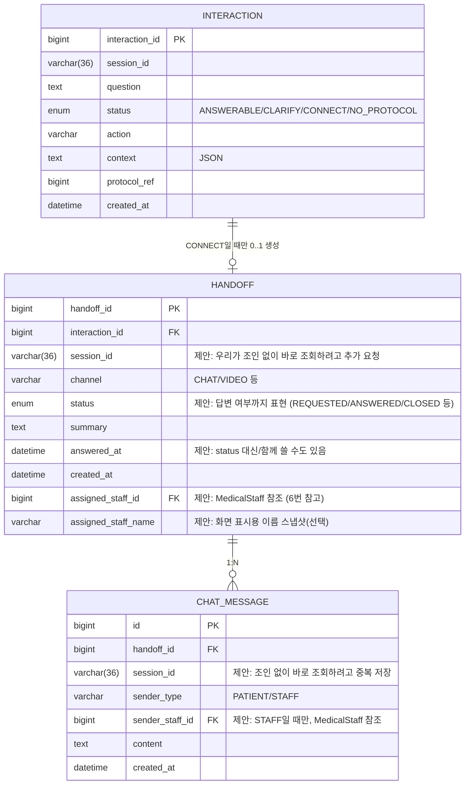

ㅅ# Interaction / Handoff / Chat 도메인 설계 (제안)

**이 문서는 Record/Notification 담당(나)이 정리한 제안 문서다.** `Interaction`/`Handoff`/`Chat`은 우리 담당 영역이 아니고, 실제 구현·필드 확정은 그 담당자 몫이다. 우리가 `HANDOFF_REPLY` 알림을 만들려면 이 도메인들이 최소한 어떤 모양이어야 하는지 필요해서 정리했다.

`Interaction`, `Handoff`는 `MALLO_Backend_Implementation_Draft_MVP_v0.1.docx` 원안이 있고, `Chat`(실제 메시지)은 docx에 아예 없던 것 — docx는 "MVP는 Mock 상태 저장으로 충분하다"고 스코프 아웃 시켜놨는데, 실채팅을 붙이기로 하면서 이번에 새로 필요해진 부분이다.

## 1. 전체 흐름

```
유저가 ASK MALLO에 질문
   ↓
Interaction 생성 (질문 1건 + 판정 결과 1건, 단발성 기록)
   ↓ status=CONNECT (의료 판단 필요 질문으로 판정됨)
유저가 "의료진에게 문의하기" CTA 클릭 (자동 아님, 유저 액션 필요)
   ↓
Handoff 생성 (상담 "티켓" — 이 Interaction에서 시작된 상담 요청)
   ↓
Chat 시작 — 환자/의료진이 ChatMessage를 주고받음
   ↓ 의료진이 첫 메시지를 보내는 순간
Handoff.status 를 "답변 도착" 상태로 갱신  ← Chat 저장 로직이 직접 해야 함
   ↓
(Record/Notification 도메인이 Handoff를 폴링해서 HANDOFF_REPLY 알림 발송)
```

## 2. ERD



## 3. `Interaction` — 필드 설명 (docx 원안)

| 필드 | 설명 |
|---|---|
| `interaction_id` | PK |
| `session_id` | 어느 세션의 질문인지 |
| `question` | 유저가 입력한 질문 원문 |
| `status` | 판정 결과. 4가지 중 하나 (아래 표) |
| `action` | 생활 행동 질문으로 분류된 경우 추출된 행동 코드 (예: EXERCISE) |
| `context` | Protocol 매칭에 쓰인 조건 값들 (JSON) — 예: `{"intensity":"HIGH"}` |
| `protocol_ref` | 매칭에 성공했을 때 그 Protocol 참조 |
| `created_at` | 생성 시각 |

**`status` 4가지 값**

| 값 | 의미 |
|---|---|
| `ANSWERABLE` | Protocol 매칭 성공, AI/규칙 기반으로 답변 가능 |
| `CLARIFY` | 답변에 필요한 정보(context)가 부족해서 되물어야 함 |
| `CONNECT` | 의료 판단이 필요한 질문 — AI가 답 안 하고 의료진 연결로 유도 |
| `NO_PROTOCOL` | 생활 행동 질문은 맞는데 매칭되는 Protocol이 없음 |

`Handoff`로 넘어가는 건 이 중 **`CONNECT`인 것만** (그리고 유저가 실제로 CTA를 눌러야 함).

## 4. `Handoff` — 필드 설명 (docx 원안 + 이번에 추가 제안한 것 ★)

| 필드 | 설명 |
|---|---|
| `handoff_id` | PK |
| `interaction_id` | 어느 질문(Interaction)에서 시작된 상담인지 |
| `session_id` ★ | docx엔 없고 `interaction_id`로만 조인해서 찾게 돼있었는데, 우리(그리고 다른 소비자들)가 조인 없이 바로 세션을 알 수 있게 여기 직접 저장 요청 |
| `channel` | 상담 채널. `CHAT`, (나중에) `VIDEO` 등 — 값 목록 미확정 |
| `status` | 티켓 상태. **채널 무관하게 "답변 왔는지"를 여기서 판단할 수 있어야 함** (아래 5번 참고) |
| `summary` | 의료진에게 전달되는 상담 요약(시술명/DAY/질문 내용 등) |
| `answered_at` ★ | `status` 대신 또는 같이 쓸 수 있는 타임스탬프 옵션. 답변 도착 여부를 상태값보다 시간값으로 표현하고 싶으면 이걸로 |
| `created_at` ★ | docx 원안엔 없었지만 다른 테이블과의 일관성을 위해 추가 제안 |
| `assigned_staff_id` ★ | 담당 의료진 식별자. `MedicalStaff.staff_id`를 가리키는 실제 FK (6번 참고 — DERNA 백엔드가 없어서 MALLO가 자체 관리) |
| `assigned_staff_name` ★ | 담당 의료진 표시용 이름 스냅샷(선택, 조인으로 대체 가능). 6번 참고 |

### 4-1. `status`가 "답변 여부"까지 표현해야 하는 이유

`channel`이 CHAT이든 나중에 VIDEO가 추가되든, 우리(알림 도메인)는 **`Handoff` 하나만 폴링**해서 "답변 왔는지"를 판단하고 싶다. 채널마다 다른 데이터 소스(채팅 메시지 테이블, 영상통화 로그 등)를 각각 찾아다니지 않으려면, "답변 도착"이라는 사실이 채널 구현체에서 **Handoff 쪽으로 한 번 반영**돼야 한다.

그래서 Chat 쪽 구현 시 필수: **의료진이 첫 메시지를 보내는 순간, 그 저장 로직 안에서 `handoff.status`(또는 `answered_at`)를 같이 갱신**해야 한다.

## 5. `ChatMessage` — 필드 설명 (신규, docx에 없음)

| 필드 | 설명 |
|---|---|
| `id` | PK |
| `handoff_id` | 어느 상담 티켓 소속 메시지인지 |
| `session_id` ★ | Handoff 조인 없이 바로 조회하려고 중복 저장 제안 |
| `sender_type` | `PATIENT` / `STAFF` — 누가 보낸 메시지인지 |
| `sender_staff_id` ★ | `sender_type=STAFF`일 때만 값 존재. `MedicalStaff.staff_id` FK. 6번 참고 |
| `content` | 메시지 본문 |
| `created_at` | 발신 시각 |

## 6. 의료진(Staff) — 별도 도메인이 필요한가

**정정: 필요하다.** 처음엔 "`clinic_id`처럼 DERNA가 갖고 있는 걸 참조만 하면 된다"고 썼는데 틀렸다 — 확인해보니 **DERNA는 실제 백엔드가 없고 프론트엔드 정적 이미지/모크 화면 하나뿐**이다(`frontend/assets/images/derna-home.png`). 참조할 외부 시스템 자체가 지금 존재하지 않는다. 그러니 MALLO가 최소한의 의료진 정보는 자체적으로 가져야 한다.

**`MedicalStaff` — 최소 필드로 신규 제안**

| 필드 | 설명 |
|---|---|
| `staff_id` | PK |
| `name` | 의료진 이름 (S12 "담당 의료진 정보"에 표시) |
| `clinic_name` | 소속 병원명 (문자열로 단순 보관, 별도 Clinic 테이블은 안 만듦 — 지금 스코프에서 병원 자체를 관리할 필요는 없어서) |
| `photo_url` | 프로필 사진, nullable |
| `created_at` | 생성 시각 |

이 정도만 있으면 `Handoff.assigned_staff_id`가 여기를 가리키는 **진짜 FK**가 될 수 있다 (외부 참조가 아니라 우리 프로젝트 안의 테이블이니까). `assigned_staff_name`처럼 이름을 스냅샷으로 중복 저장할지, 그냥 조인해서 쓸지는 취향 차이 — 데이터 양이 적어서 조인해도 무방하다.

`MedicalStaff` 데이터는 유저가 만드는 게 아니라 운영자/관리자가 등록하는 값이라 관리자 등록 화면(또는 그냥 초기 데이터 seed)이 별도로 필요하다 — 이것도 8번 확정 목록에 추가.

## 7. 우리(Record/Notification) 도메인과의 연결점

- 우리는 `Handoff`를 **읽기 전용으로 폴링**한다 (`session_id`, `status`/`answered_at`만 필요) — 이 도메인이 우리를 위해 API나 훅을 만들어줄 필요 없음.
- `ChatMessage`는 우리가 직접 볼 일이 없다 — Handoff에 답변 여부가 반영되면 그걸로 끝.
- 자세한 알림 발송 흐름은 `docs/RECORD_NOTIFICATION_DOMAIN_DESIGN.md`의 2-1/2-3 참고.

## 8. 담당자가 확정해야 하는 것 (여기서부터는 우리가 정할 수 없음)

- `status` enum의 정확한 값 목록 (예: `REQUESTED`, `ANSWERED`, `CLOSED` 등 — 지금은 "답변 여부는 구분돼야 한다"까지만 정함)
- `channel` enum 값 목록 (`CHAT`만 있을지, `VIDEO`까지 갈지)
- `summary`를 누가/언제 채우는지 (AI가 Interaction 기반으로 자동 생성? 유저가 직접 입력?)
- 환자 쪽 메시지 읽음 처리(안 읽음 배지 등)가 필요한지 — 필요하면 `ChatMessage`에도 `is_read` 같은 필드가 있어야 함
- `MedicalStaff` 데이터를 누가 어떻게 입력하는지 (관리자 등록 화면을 따로 만들지, 초기 seed 데이터로 몇 명만 넣고 시작할지 — 해커톤 스코프면 후자가 현실적)
- Handoff/Chat 담당자가 세션 담당자와 같은 사람인지 (연락/요청 대상 확인용)
- **DERNA가 정말 아무 백엔드도 없는 게 맞는지 팀 전체에 재확인** — 이번에 잘못 짚었던 것처럼, `clinic_id`를 비롯해 "DERNA가 갖고 있겠지"라고 가정하고 넘어간 다른 부분들도 다시 점검 필요
