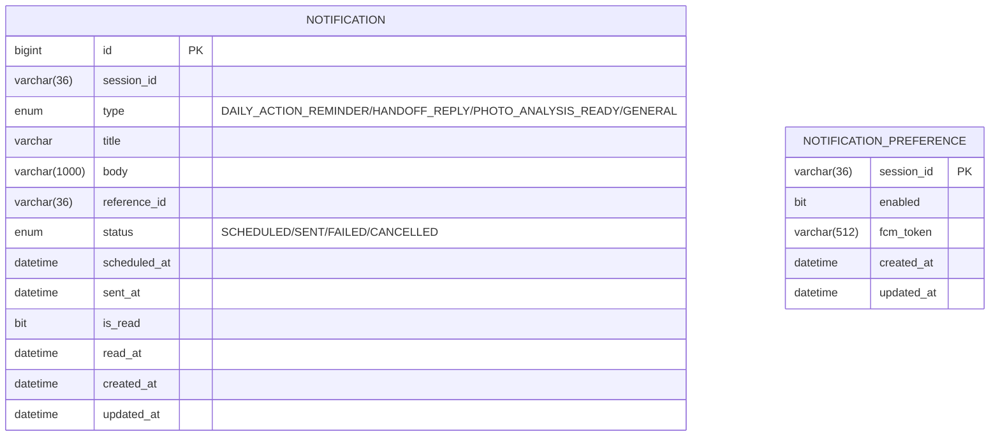

# feat: Notification 도메인 구현 + 실제 FCM 발송 연동

## 개요

알림 인박스(조회/읽음 처리), 알림 설정(수신 동의/FCM 토큰 등록), 그리고 실제 FCM(Firebase Cloud Messaging) 발송까지 구현했습니다. API 4개, 실제 Google 인증까지 통과 확인, 테스트 21개 전부 통과.

Swagger UI: `http://localhost:8080/swagger-ui/index.html` (`/v3/api-docs`)

---

## API 엔드포인트

| Method | Path | 설명|
|---|---|---|
| `GET` | `/v1/sessions/{sessionId}/notifications` | 알림 인박스 조회 (예약 시각 내림차순) |
| `PATCH` | `/v1/sessions/{sessionId}/notifications/{notificationId}/read` | 알림 읽음 처리 |
| `GET` | `/v1/sessions/{sessionId}/notification-preference` | 알림 설정 조회 (없으면 기본값으로 생성) |
| `PATCH` | `/v1/sessions/{sessionId}/notification-preference` | 알림 설정 변경 (수신 동의 여부 / FCM 토큰) |

모든 응답은 공통 포맷으로 감싸서 내려갑니다.

```jsonc
// 성공
{ "success": true, "data": { ... }, "message": null }
// 실패
{ "success": false, "data": null, "message": "에러 메시지" }
```

---

## 1. `GET /v1/sessions/{sessionId}/notifications` — 인박스 조회

파라미터 없음. 세션의 전체 알림을 `scheduledAt` 내림차순으로 반환합니다.

**Response** (`data[]`)

| 필드 | 타입 | 설명 |
|---|---|---|
| `id` | `Long` | 알림 id |
| `sessionId` | `String` | 세션 id |
| `type` | `enum` | `DAILY_ACTION_REMINDER` \| `HANDOFF_REPLY` \| `PHOTO_ANALYSIS_READY` \| `GENERAL` |
| `title` / `body` | `String` | 제목 / 본문 |
| `referenceId` | `String` | 탭했을 때 이동할 대상 id. `PHOTO_ANALYSIS_READY`면 **recordId**(사진 id 아님) |
| `status` | `enum` | `SCHEDULED` \| `SENT` \| `FAILED` \| `CANCELLED` — **`SENT`는 실제로 FCM 발송까지 성공했다는 뜻**, `FAILED`는 설정 꺼짐/토큰 없음/FCM 에러 등으로 미발송. 둘 다 인박스에는 그대로 보임 (앱 내 알림함은 푸시 발송 여부와 무관하게 항상 표시) |
| `read` | `boolean` | 읽음 여부 |
| `scheduledAt` / `sentAt` / `readAt` | `LocalDateTime` | 예약(생성) / 실제 발송 성공 / 읽은 시각. 아직이면 `sentAt`/`readAt`은 `null` |

```json
{
  "success": true,
  "data": [
    {
      "id": 5, "sessionId": "...", "type": "PHOTO_ANALYSIS_READY",
      "title": "사진 분석이 끝났어요", "body": "업로드한 사진의 관찰 결과를 확인해보세요.",
      "referenceId": "11", "status": "SENT", "read": false,
      "scheduledAt": "...", "sentAt": "...", "readAt": null
    }
  ],
  "message": null
}
```

---

## 2. `PATCH /v1/sessions/{sessionId}/notifications/{notificationId}/read` — 읽음 처리

파라미터 없음. 성공하면 갱신된 알림을 응답으로 돌려줍니다.

---

## 3. `GET /v1/sessions/{sessionId}/notification-preference` — 알림 설정 조회

세션당 1행이며, 없으면 기본값(`enabled: false`, 토큰 없음)으로 자동 생성해서 반환합니다.

| 필드 | 타입 | 설명 |
|---|---|---|
| `sessionId` | `String` | 세션 id |
| `enabled` | `boolean` | 알림 수신 동의 여부 |
| `hasFcmToken` | `boolean` | FCM 토큰 등록 여부 (토큰 원문은 응답에 안 실음) |

---

## 4. `PATCH /v1/sessions/{sessionId}/notification-preference` — 알림 설정 변경

**Request** — 둘 다 선택, 부분 수정 (안 보낸 필드는 기존 값 유지)

| 필드 | 타입 | 필수 | 제약 | 설명 |
|---|---|---|---|---|
| `enabled` | `Boolean` | X | - | 알림 수신 동의 여부 |
| `fcmToken` | `String` | X | 최대 512자 | **네이티브 FCM 등록 토큰만 허용.** Expo `getDevicePushTokenAsync()` 결과여야 함 — `getExpoPushTokenAsync()`가 주는 `ExponentPushToken[...]` 형식은 FCM에 직접 못 보내서 여기 넣으면 안 됨 (EAS Build/dev client 필요, Expo Go로는 못 받는 값) |

```json
{ "enabled": true, "fcmToken": "실제 FCM 등록 토큰" }
```

---

## 에러 응답

| HTTP | 상황 | 메시지 |
|---|---|---|
| `400` | 다른 세션의 알림에 접근 | `"다른 세션의 알림에는 접근할 수 없습니다."` |
| `400` | 알림 설정 요청 검증 실패 | `@Valid` 필드별 메시지 |
| `404` | 존재하지 않는 알림 | `"알림을 찾을 수 없습니다."` |

---

## 도메인 설계

### ERD



- `session_id`는 다른 도메인 소유라 FK 안 걸고 값만 보관
- `NotificationPreference`는 세션당 1행(1:1)이라 surrogate id 없이 `session_id` 자체를 PK로 사용
- 스케줄·발송 이력·읽음 상태를 테이블 하나(`notification`)로 통합 — 상태 전이(`status`, `is_read`)로 표현하는 게 조인 없이 조회하기 더 간단하다고 판단
- 인덱스: `(session_id, scheduled_at)` 인박스 조회용, `(status, scheduled_at)` 발송 워커 폴링용

### 알림 트리거 현황

| type | 트리거 시점 | 상태 |
|---|---|---|
| `PHOTO_ANALYSIS_READY` | 사진들이 Recovery Record에 실제로 연결되는 시점 | ✅ 구현 완료 (아래 참고) |
| `DAILY_ACTION_REMINDER` | 세션의 `elapsed_day`가 바뀌는 시점 | ⏸ 세션 도메인 완성 전까지 보류 |
| `HANDOFF_REPLY` | 의료진 상담 채팅에 답변 도착 시점 | ⏸ Handoff 도메인 완성 전까지 보류 |
| `GENERAL` | 트리거 없음 | enum만 존재, 미구현 |

**`PHOTO_ANALYSIS_READY` 트리거 위치가 한 번 바뀌었습니다**: 처음엔 `PhotoRecordService.upload()`(사진 한 장 업로드마다) 안에서 호출했는데, "사진 여러 장을 동시에 분석하고 최종 결과가 나왔을 때 알림 1번만"으로 확정되면서 `RecoveryRecordService.create()`/`update()`(사진들이 실제로 기록에 연결되는 시점)로 옮겼습니다. 그래서:
- 기록 하나에 사진을 몇 장 연결하든 알림은 **정확히 1건**만 생성됩니다.
- `referenceId`는 사진 id가 아니라 **그 기록(recordId)**을 가리킵니다 — 탭하면 사진이 아니라 기록으로 이동.

### 발송 로직 — "인박스는 항상 남기고, 발송 성공 여부만 status로 구분"

```
알림 생성 (Notification row 저장, status=SCHEDULED)
   ↓
NotificationPreference 조회
   ↓
enabled=true && fcmToken 있음?
   ├─ 예 → FCM 실제 발송 시도 → 성공: status=SENT / 실패: status=FAILED
   └─ 아니오 → 발송 시도 자체를 안 함 → status=FAILED
```

알림 설정이 꺼져있거나 토큰이 없어도 **인박스 row 자체는 항상 생성**됩니다 — 앱 안 알림함은 푸시 발송 여부와 무관하게 계속 보여야 하기 때문입니다. `status`는 오직 "실제로 FCM에 전달됐는가"만 의미합니다.

### FCM 연동

- `firebase-admin` SDK(`9.10.0`) 사용
- 서비스 계정 키를 **두 가지 방식 중 아무거나**로 받도록 지원:
  - `FCM_CREDENTIALS_PATH` — 로컬 파일 경로
  - `FCM_CREDENTIALS_JSON` — JSON 원문을 환경변수에 통째로 (파일 불필요, 배포 플랫폼에 편함)
- **둘 다 비어있어도 앱은 정상 기동**됩니다 (`FirebaseConfig`가 경고 로그만 남기고 `FirebaseMessaging` 빈을 등록 안 함) — FCM 담당자가 아닌 다른 팀원이 키 없다고 로컬 실행을 못 하면 안 되기 때문. `FirebaseNotificationSender`가 `ObjectProvider`로 이 빈의 부재를 안전하게 처리해서, 발송 시도만 조용히 `false`를 반환합니다.

### 안전장치

- 다른 세션의 알림 읽음 처리 시도 차단 (`NOTIFICATION_SESSION_MISMATCH`)
- `fcmToken`이 Expo Go의 `ExponentPushToken[...]` 형식이면 안 된다는 걸 Swagger 설명에 명시 — 실제 FCM에 못 보내는 값이라 발송이 항상 실패하게 됨

자세한 설계 배경은 `docs/RECORD_NOTIFICATION_DOMAIN_DESIGN.md` 참고.

---

## 실제 검증 (real MySQL + 실제 Google 인증)

1. **FCM 미설정 상태에서 정상 기동** — 경고 로그만 남고 앱은 뜸
2. **가짜 토큰으로 실제 FCM 서버까지 요청** — 응답이 `"The registration token is not a valid FCM registration token"` → **인증(서비스 계정)은 성공, 토큰만 무효**임을 확인 (자격증명 자체가 문제였다면 다른 종류의 인증 에러가 났을 것)
3. **서비스 계정 키 유출 대응** — 1차 발급 키가 채팅에 노출되어 Firebase 콘솔에서 폐기 후 재발급, 새 키로 동일하게 인증 통과 재확인
4. **사진 2장 업로드 → 기록 연결 시 알림 정확히 1건** 생성, `referenceId`가 그 기록의 id와 일치하는 것까지 확인 (`backend-record` 머지 이후)
5. 알림 설정 켜고 실제 토큰 없이(가짜 토큰) 발송 시도 → `status: FAILED`로 정확히 남는 것 확인

---

## 테스트

**21개 전부 통과** (Notification 도메인 한정, 전체 스위트는 Record 포함 63개)

| 테스트 클래스 | 개수 | 내용 |
|---|---|---|
| `NotificationServiceTest` | 10 | 인박스 조회, 읽음 처리(세션 격리 포함), 알림 생성 시 발송 로직(설정 on/off·토큰 유무별 SENT/FAILED 분기), 설정 조회/수정 |
| `NotificationControllerTest` | 5 | 각 API 200/400/404 매핑 |
| `NotificationRepositoryTest` | 2 | 인박스 정렬, 발송 대상 폴링 쿼리 |
| `FirebaseNotificationSenderTest` | 4 | FCM 미설정 시 false, 토큰 없음 시 false, 발송 성공/실패 분기 |

---

## 프론트 연동 시 확인된 것

- fcmToken은 **EAS Build/dev client로 빌드한 네이티브 앱**에서 `expo-notifications`의 `getDevicePushTokenAsync()`로 받은 값만 유효합니다. Expo Go 앱에서 테스트하는 `getExpoPushTokenAsync()`의 `ExponentPushToken[...]` 값은 이 API에 넣으면 발송이 항상 실패합니다.
- iOS는 Firebase 콘솔의 Cloud Messaging 설정에 APNs 인증 키(.p8) 업로드가 별도로 필요합니다 (FCM이 APNs로 릴레이하는 구조라서).
