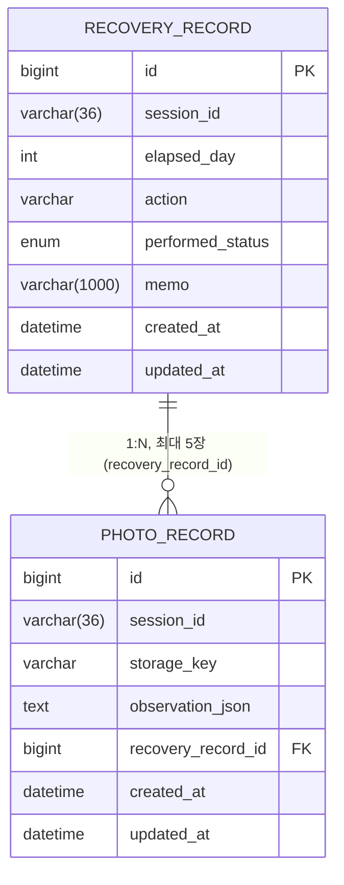

# feat: Recovery Record/Photo 도메인 구현 (S09/S10)

## 개요

DAY별 회복 기록(S09 Recovery Record)과 그 기록 전체 조회(S10 Recovery Journal), 선택적으로 붙는 사진(최대 5장) 업로드 기능을 구현했습니다. API 5개, 실제 MySQL 연동 검증 완료, 테스트 63개 전부 통과.

Swagger UI: `http://localhost:8080/swagger-ui/index.html` (`/v3/api-docs`)

---

## API 엔드포인트

| Method | Path | 설명|
|---|---|---|
| `POST` | `/v1/sessions/{sessionId}/photos` | 사진 업로드(한 장) + 비의료적 관찰 결과 반환 |
| `POST` | `/v1/sessions/{sessionId}/records` | 회복 기록 저장 (S09) |
| `GET` | `/v1/sessions/{sessionId}/records` | 세션의 DAY별 기록 전체 조회 (S10 Journal) |
| `GET` | `/v1/sessions/{sessionId}/records/today` | 오늘 작성한 기록 조회 (없으면 `data: null`) |
| `PATCH` | `/v1/sessions/{sessionId}/records/{recordId}` | 기록 메모/사진 수정 (당일 기록만 가능) |

모든 응답은 공통 포맷으로 감싸서 내려갑니다.

```jsonc
// 성공
{ "success": true, "data": { ... }, "message": null }
// 실패
{ "success": false, "data": null, "message": "에러 메시지" }
```

---

## 1. `POST /v1/sessions/{sessionId}/photos` — 사진 업로드 (한 장씩)

**Request**: `multipart/form-data`

| 필드 | 타입 | 필수 | 설명 |
|---|---|---|---|
| `photo` | file | O | 업로드할 사진 파일 1개 |

여러 장 붙이려면 이 API를 **여러 번 호출**해서 `id`(photoRecordId)를 프론트에서 모은 뒤, 기록 저장/수정 시 `photoRecordIds`로 같이 보내면 됩니다 (기록 1건당 최대 5장, 배치 업로드 API는 없음 — 프론트 요청사항에 맞춰 한 장씩 유지).

**Response** (`data`)

| 필드 | 타입 | 설명 |
|---|---|---|
| `id` | `Long` | 사진 id |
| `sessionId` | `String` | 세션 id |
| `observation` | `Map<String,Object>` | 비의료적 관찰 결과. **`redness`/`dryness`만 존재, 진단/위험도 필드 없음** |
| `photoUrl` | `String` | 사진을 바로 불러올 수 있는 URL |
| `createdAt` | `LocalDateTime` | 업로드 시각 |

```json
{
  "success": true,
  "data": {
    "id": 1,
    "sessionId": "99999999-9999-9999-9999-999999999999",
    "observation": { "redness": "LOW", "dryness": "MEDIUM" },
    "photoUrl": "/uploads/photos/99999999-9999-9999-9999-999999999999/6451963b-e938-4bb2-a0d4-5c71ab0fe463.jpg",
    "createdAt": "2026-08-18T21:41:41.970507"
  },
  "message": null
}
```

> 관찰 결과는 지금 Mock(고정값)이고, 사진 저장은 로컬 디스크(개발용, 나중에 서버 배포 시 경로 교체 예정)입니다.

---

## 2. `POST /v1/sessions/{sessionId}/records` — 기록 저장

**Request**

| 필드 | 타입 | 필수 | 제약 | 설명 |
|---|---|---|---|---|
| `elapsedDay` | `Integer` | O | `>= 0` | 시술 당일=0 기준 경과일 |
| `action` | `String` | O | not blank | 수행한 행동 코드 (enum 미확정, 자유 문자열) |
| `performedStatus` | `enum` | O | `DONE` \| `NOT_DONE` \| `ADJUSTED_DONE` | 실제로 했는지 여부 |
| `memo` | `String` | X | 최대 1000자 | 메모 |
| `photoRecordIds` | `List<Long>` | X | **최대 5개** | 미리 업로드한 사진 id 목록 (같은 세션 것만 연결 가능) |

```json
{
  "elapsedDay": 1,
  "action": "WOUND_CARE",
  "performedStatus": "DONE",
  "memo": "소독 완료",
  "photoRecordIds": [1, 2, 3]
}
```

**Response** (`data`) — 아래 "기록 응답 공통 필드" 참고

---

## 3. `GET /v1/sessions/{sessionId}/records` — 저널 전체 조회

파라미터 없음. `elapsedDay` 오름차순으로 세션의 전체 기록을 배열로 반환합니다.

```json
{
  "success": true,
  "data": [
    { "id": 1, "sessionId": "...", "elapsedDay": 1, "action": "WOUND_CARE", "performedStatus": "DONE", "memo": "소독 완료", "photos": [{ "...": "..." }], "createdAt": "..." },
    { "id": 2, "sessionId": "...", "elapsedDay": 2, "action": "EXERCISE", "performedStatus": "NOT_DONE", "memo": null, "photos": [], "createdAt": "..." }
  ],
  "message": null
}
```

---

## 4. `GET /v1/sessions/{sessionId}/records/today` — 오늘 기록 조회

파라미터 없음. **오늘 만든 기록이 있는지, 있으면 그 `record_id`가 뭔지를 백엔드가 직접 판단**해서 돌려줍니다 — 프론트가 3번 API(전체 목록)를 받아서 필터링할 필요가 없습니다.

- 오늘 기록 있음 → 그 기록을 그대로 반환 (`data.id`가 수정할 때 쓸 `record_id`)
- 오늘 기록 없음 → `data: null` (success는 true)

같은 날 여러 건이 존재하는 경우(설계상 허용됨) 가장 최근 것 하나를 돌려줍니다.

---

## 5. `PATCH /v1/sessions/{sessionId}/records/{recordId}` — 기록 수정

**⚠️ 당일(오늘) 작성한 기록만 수정 가능합니다.** 기록의 생성 날짜가 오늘이 아니면 403으로 거부됩니다 — 과거 DAY는 조회만 가능하고 수정은 안 됩니다.

**Request** — 둘 다 선택, 부분 수정 (안 보낸 필드는 기존 값 유지)

| 필드 | 타입 | 필수 | 제약 | 설명 |
|---|---|---|---|---|
| `memo` | `String` | X | 최대 1000자 | 수정할 메모 |
| `photoRecordIds` | `List<Long>` | X | **최대 5개** | 새로 연결할 사진 id 목록. **빈 배열 `[]`을 보내면 기존 사진 전체 삭제**, 생략하면 기존 사진 유지 |

```json
{ "memo": "수정된 메모" }
```

---

## 기록 응답 공통 필드 (`RecoveryRecordResponse`)

`POST /records`, `GET /records`, `GET /records/today`, `PATCH /records/{id}` 전부 이 형태로 응답합니다.

| 필드 | 타입 | 설명 |
|---|---|---|
| `id` | `Long` | 기록 id |
| `sessionId` | `String` | 세션 id |
| `elapsedDay` | `Integer` | 경과일 |
| `action` | `String` | 행동 코드 |
| `performedStatus` | `enum` | `DONE` \| `NOT_DONE` \| `ADJUSTED_DONE` |
| `memo` | `String \| null` | 메모 |
| `photos` | `List<PhotoRecordResponse>` | 연결된 사진 목록 (id 오름차순), 없으면 `[]` — **더 이상 단일 객체 아님** |
| `createdAt` | `LocalDateTime` | 생성 시각 |

---

## 에러 응답

| HTTP | 상황 | 메시지 |
|---|---|---|
| `400` | 요청 검증 실패 (`@Valid`) | 필드별 메시지, 예: `"elapsedDay: 널이어서는 안됩니다"`, `"photoRecordIds: 사진은 최대 5장까지 첨부할 수 있습니다."` |
| `400` | 다른 세션의 기록을 수정하려 함 | `"다른 세션의 기록은 수정할 수 없습니다."` |
| `400` | 다른 세션의 사진을 연결하려 함 | `"다른 세션의 사진은 연결할 수 없습니다."` |
| `403` | 오늘 작성한 기록이 아닌데 수정 시도 | `"오늘 작성한 기록만 수정할 수 있습니다."` |
| `404` | 존재하지 않는 기록 수정 시도 | `"기록을 찾을 수 없습니다."` |
| `404` | 존재하지 않는 사진 연결 시도 | `"사진을 찾을 수 없습니다."` |
| `500` | 사진 저장 실패 | `"사진 저장에 실패했습니다."` |

---

## 도메인 설계

### ERD



- `session_id`는 세션 도메인 소유라 FK 안 걸고 값만 보관 (`varchar(36)`, UUID)
- **FK 방향이 바뀜**: 사진이 기록보다 먼저 만들어지는 흐름(먼저 업로드 → 나중에 기록에 연결) 때문에, FK는 `photo_record.recovery_record_id`가 갖습니다 (`recovery_record.photo_record_id`가 아님). 업로드 직후에는 `null`이었다가 기록 생성/수정 시 연결됩니다.
- 인덱스: `idx_recovery_record_session_day (session_id, elapsed_day)` — 저널 조회 전용
- `(session_id, elapsed_day, action)` 유니크 제약 없음 — 하루에 같은 행동을 여러 번 기록 가능하게 의도적으로 허용
- `performed_status`는 `EnumType.STRING` → MySQL 네이티브 `ENUM` 컬럼으로 매핑

### 성능 — N+1 수정

저널 조회(`GET /records`)에서 기록마다 사진들이 lazy 로딩되면서 N+1이 발생했던 걸 `@EntityGraph(attributePaths = "photoRecords")`로 고쳤습니다. 실측: 기록 3건 기준 쿼리 4번 → 1번 (`LEFT JOIN`). 회귀 테스트로 고정(`RecoveryRecordRepositoryTest`).

### 사진 저장 방식

`PhotoStorageAdapter` 인터페이스 + 로컬 디스크 구현체(`LocalPhotoStorageAdapter`, `uploads/photos/{sessionId}/{uuid}.ext`)로 구현. 나중에 S3 등으로 옮길 때 이 인터페이스 구현체만 교체하면 되도록 설계 (사진 관찰 어댑터 `PhotoObservationAdapter`와 동일한 패턴). 정적 리소스 서빙은 `PhotoStorageConfig`가 담당.

### 당일 수정 정책

세션 도메인의 `elapsed_day` 없이도 판단 가능하도록, **기록의 생성일(`createdAt`)이 오늘 날짜인지**로 수정 가능 여부를 검사합니다 (세션 도메인과의 의존성을 안 만들려는 의도). "기록은 항상 그날 안에만 생성되고 나중에 다른 날짜로 소급 생성하지 않는다"는 전제 위에서 성립합니다.

### 안전장치

- 다른 세션의 기록/사진에 접근·연결 시도 시 전부 차단 (`RECORD_SESSION_MISMATCH`, `PHOTO_SESSION_MISMATCH`)
- 사진 관찰 결과에 `normal`/`side_effect`/`diagnosis`/`risk_score` 등 의료 판단 필드 절대 포함 안 함 — `redness`/`dryness`만
- 당일이 아닌 기록은 수정 API 자체에서 차단 (`RECORD_NOT_EDITABLE`, 403) — 프론트 CTA 제한과 별개로 백엔드에서도 이중으로 막음

자세한 설계 배경은 `docs/RECORD_NOTIFICATION_DOMAIN_DESIGN.md`, 프론트 Q&A는 `docs/S09_S10_PHOTO_QA_REPLY.md` 참고.

### Notification 도메인과의 연동 (참고)

`PHOTO_ANALYSIS_READY` 알림은 사진이 실제로 기록에 붙는 시점(`RecoveryRecordService.create()`/`update()`)에 한 번만 발송됩니다 — 사진 여러 장을 한 기록에 연결해도 알림은 1건만 나갑니다 ("n장 동시 분석 후 최종 결과 1번" 확정). `referenceId`는 사진 id가 아니라 **기록(record) id**를 가리킵니다.

---

## 테스트

**63개 전부 통과** (`./gradlew test`)

| 테스트 클래스 | 내용 |
|---|---|
| `RecoveryRecordServiceTest` (+ Create/Update/GetToday 중첩) | 생성/조회/수정/오늘조회, 세션 격리, 당일 수정 정책, 알림 발송 여부 검증 |
| `PhotoRecordServiceTest` | 업로드, 관찰 결과 파싱, not found |
| `LocalPhotoStorageAdapterTest` | 파일 저장/URL 생성, 경로 조작 방어 |
| `RecoveryRecordControllerTest` | 검증 실패 400, 정상 200, 403/404 매핑, 오늘 기록 조회 |
| `PhotoRecordControllerTest` | 업로드 응답 |
| `RecoveryRecordRepositoryTest` | DAY 정렬, 세션 격리, 사진 다중 연결/교체, **N+1 회귀 테스트**, 오늘 기록 조회 쿼리 |
| `BackendApplicationTests` | 컨텍스트 로딩 |
| (Notification 도메인 테스트 다수) | `backend-noti` 브랜치 병합분 |

실제 로컬 MySQL(`mallo-mysql` docker)에 직접 붙여서 검증한 것들:
- 업로드→생성→조회→수정 전체 플로우, 에러 케이스
- 사진 2장 업로드 → 기록 연결 → **알림 정확히 1건**, `referenceId`가 기록 id와 일치하는 것까지 확인
- 당일 기록 수정 성공(200) / DB에서 생성일을 어제로 바꾼 뒤 수정 시도 시 403 / 조회는 그대로 되는 것
- 오늘 기록 없을 때 `data: null`, 생성 후 즉시 조회하면 `record_id` 포함해서 반환되는 것
