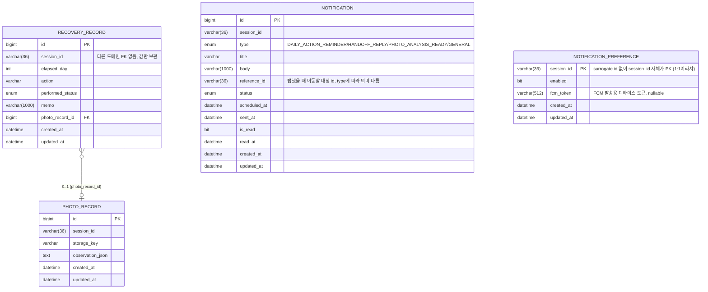

# Record / Notification 도메인 설계

담당 범위: `RecoveryRecord`, `PhotoRecord`, `Notification`, `NotificationPreference`.
`RecoverySession` / `Protocol` / `ActionCheck` / `Interaction` / `Handoff`는 다른 담당자 영역이라 이 문서에서 다루지 않는다 (`MALLO_Backend_Implementation_Draft_MVP_v0.1.docx` 참고).

## 1. ERD



`RecoverySession`과의 관계는 실제 FK가 아니라 `session_id` 값 참조다 (아래 3-1 참고).

## 2. 왜 이렇게 나눴나

- **RecoveryRecord**: S09 화면에서 "행동을 실제로 했는지"를 DAY 단위로 남기는 로그. 세션당 여러 행이 쌓인다 (하루에 여러 행동을 체크할 수 있어서 `(session_id, elapsed_day)` 유니크는 걸지 않음 — 하나의 DAY에 행동별로 여러 기록이 있을 수 있다고 가정).
  - `photoRecord`는 `@OneToOne(LAZY)`인데, Journal 조회(`findBySessionIdOrderByElapsedDayAsc`)에서 기록마다 사진 관찰 결과를 같이 내려줘야 해서 서비스 쪽에서 결국 필드에 접근하게 된다. EntityGraph 없이 그냥 두면 기록 건수만큼 `photo_record`를 추가로 SELECT하는 N+1이 실제로 발생함을 로컬 MySQL에 붙여서 직접 확인했다(기록 3건 → 쿼리 4번). 그래서 이 조회 메서드에만 `@EntityGraph(attributePaths = "photoRecord")`를 걸어 LEFT JOIN FETCH 한 방으로 가져오게 했다 — 필드 기본값을 `EAGER`로 바꾸지 않은 이유는, 사진이 없는 케이스(대부분)에서까지 매번 조인하게 만들고 싶지 않아서고, 지금처럼 실제로 같이 쓰는 조회 지점에만 국소적으로 EntityGraph를 얹는 게 더 안전하다고 판단했다.
- **PhotoRecord**: 사진 + 비의료적 관찰 결과만 별도 테이블로 분리. RecoveryRecord에 사진이 선택 사항이라 1:0..1로 뺐고, `normal/side_effect/risk_score` 같은 의료 판단 필드는 절대 추가하지 않는다 (MVP 문서 10번 규칙).
- **Notification**: 스케줄·발송 이력·인박스(읽음 상태)를 한 테이블에 통합했다. 세 개로 쪼개는 대안도 있었지만, 결국 "한 알림 건의 상태가 시간 순으로 전이"하는 것뿐이라 상태 컬럼(`status`, `is_read`)으로 표현하는 게 조인 없이 조회하기 더 간단하다고 판단. FCM 실채널·트리거 확정 후 `type`에 `HANDOFF_REPLY`(의료진 채팅 답변 도착), `PHOTO_ANALYSIS_READY`(사진 분석 결과 도착)를 추가했다 — 셋 다(`DAILY_ACTION_REMINDER` 포함) 미리 한꺼번에 예약해두는 게 아니라, 해당 이벤트(DAY 전환/Handoff 답변/사진 분석 완료)가 실제로 발생한 시점에 그때그때 한 건씩 생성한다 (`scheduled_at`을 생성 시점(now)으로 넣고 바로 발송 처리). 자세한 트리거 시점은 2-1 참고. 탭했을 때 관련 화면으로 이동할 수 있게 `reference_id`(대상 id, `session_id`와 같은 패턴으로 FK 없이 값만 보관)를 추가했다.
- **NotificationPreference**: 계정(User) 개념이 아직 없어서 세션 1개당 1행. 알림 on/off(`enabled`)뿐 아니라 실제 FCM 발송에 필요한 디바이스 토큰(`fcm_token`)도 여기서 같이 관리한다 — "이 세션에 푸시를 보내려면 필요한 것"이 다 여기 모여있는 셈. 나중에 User가 생기면 `session_id` 대신 `user_id`로 옮겨야 할 가능성 있음 (6번 참고).

### 2-1. 알림 발생 시점(트리거) 확정

`Notification` 행이 실제로 언제 생성되는지 타입별로 정리. (담당자 논의로 확정, 2026-08-18)

| type | 트리거 시점 | 우리 도메인만으로 되는가 |
|---|---|---|
| `DAILY_ACTION_REMINDER` | 세션 **생성 시점이 아니라**, 세션의 `elapsed_day`가 바뀌는 시점(DAY 전환) | ❌ — "오늘 DAY가 바뀐 세션 목록"을 알아야 해서 세션 도메인 연동 필요. 세션 생성 시 7개를 한 번에 예약하는 방식은 채택 안 함 (DAY가 실제로 넘어갈 때만 생성) |
| `HANDOFF_REPLY` | 의료진 상담(Handoff) 채팅에 실제 답변이 도착하는 시점 | ❌ — 실채팅 연동 예정. Handoff 도메인이 답변을 저장하는 시점에 우리 쪽을 호출하는 훅이 필요 |
| `PHOTO_ANALYSIS_READY` | 사진 분석 결과가 `PhotoRecord.observation_json`에 반영되는 시점 | ✅ — 우리 도메인 안에서 완결. `PhotoRecordService`가 관찰 결과 저장하는 트랜잭션 끝에서 바로 `Notification` 생성하면 됨 |
| `GENERAL` | 트리거 없음 | 이번 스코프에서는 enum/도메인만 만들어두고 패스. 실제 발송 로직 없음 |

### 2-2. 세션 담당자한테 요청할 것

**요청: `RecoverySession` 읽기 전용 조회**(같은 모놀리스면 Repository 직접 참조, 서비스가 분리되면 조회 API). 우리를 위해 훅/이벤트를 따로 만들어달라고 요청할 필요는 없음 — 이것만 있으면 우리 쪽 배치가 주기적으로 폴링해서 스스로 판단한다.

이 조회 권한으로 우리 쪽에서 하는 일:
- 배치가 "어제 대비 `elapsed_day`가 바뀐 세션"을 찾아 `DAILY_ACTION_REMINDER` 생성
- 세션 상태도 같이 보고, 비활성 세션인데 `Notification.status=SCHEDULED`로 남은 알림이 있으면 우리가 `cancel()`

곁들여 확인만 하면 되는 것:
- `(session_id, elapsed_day, action)` 중복 허용 여부 — 하루에 같은 행동을 여러 번 체크/기록할 수 있는 플로우인지 (RecoveryRecord 유니크 제약 결정에 필요, 6번 참고)
- `session_id` 문자열 직렬화 형식 재확인 — 하이픈 포함 표준 UUID, 소문자인지

### 2-3. Handoff 관련 (담당자 별도 확인 필요)

`Handoff`(의료진 상담 연결)는 docx 기준 ASK MALLO/상담(Interaction, CONNECT) 흐름에 딸린 엔티티라 세션 담당자와는 다른 사람이 담당할 수 있다. **누가 담당인지부터 확인하고, 그 담당자한테 별도로 요청.**

요청: `Handoff` 읽기 전용 조회. 이걸로 우리 배치가 "마지막 체크 이후 새로 답변된 것"을 찾아 `HANDOFF_REPLY`를 생성한다.

**나중에**
- User 계정 도입되면 `NotificationPreference`를 세션 단위 → 유저 단위로 옮길지 (6번 참고)

## 3. InnoDB 관점에서의 설계 근거

### 3-1. PK는 `BIGINT AUTO_INCREMENT` — UUID를 안 쓴 이유

InnoDB는 PK 기준으로 데이터 페이지가 물리적으로 정렬되는 클러스터드 인덱스 구조다. `AUTO_INCREMENT`는 항상 오름차순으로 삽입되므로 새 행이 항상 마지막 페이지에만 append된다 → 페이지 분할(page split), 단편화가 거의 없다.

반대로 PK를 UUID(랜덤 문자열)로 잡으면 삽입 위치가 매번 랜덤해져서 기존 페이지 중간에 꽂히고, 그때마다 페이지 분할이 일어나 쓰기 성능이 나빠지고 디스크 상 데이터가 흩어진다. `Notification`, `RecoveryRecord`처럼 계속 insert가 쌓이는 로그성 테이블일수록 이 차이가 커진다.

→ 그래서 내부 PK는 기본적으로 `IDENTITY`(AUTO_INCREMENT)로 잡았다. 외부에 노출해야 하는 식별자(세션 ID 등)가 필요하면 PK와 분리해서 별도 컬럼으로 둔다.

**예외 — `NotificationPreference`**: 이 테이블만 `session_id`를 그대로 PK로 썼다. 이유는 두 가지가 동시에 성립하기 때문이다.
1. 세션당 정확히 1행(1:1)이라 자연키(natural key)로 써도 "여러 행에 같은 값이 반복돼서 인덱스가 커지는" 문제가 없다.
2. 쓰기 빈도가 매우 낮다(세션 생성 시 1번, 토글 시 가끔). 위에서 말한 "랜덤 삽입 → 페이지 분할" 단점은 insert가 잦은 테이블에서 크게 작용하는 것이지, 이 테이블처럼 거의 안 쓰는 곳에서는 체감되지 않는다.

대신 얻는 이득: surrogate `id` 컬럼과 그 위의 유니크 세컨더리 인덱스를 아예 없앨 수 있고, `session_id`로 조회할 때 "유니크 인덱스 조회 → PK로 재조회(bookmark lookup)"하는 한 단계가 사라져서 클러스터드 인덱스로 바로 조회된다.

`RecoveryRecord`/`Notification`은 세션당 여러 행(1:N)이라 이 방식을 못 쓴다 — `session_id`를 PK로 쓰면 같은 세션의 다른 행을 저장할 수 없다. 그래서 이 둘은 계속 surrogate PK + 세컨더리 인덱스 조합을 쓴다.

### 3-2. 세컨더리 인덱스 — 실제 조회 패턴 기준으로만 추가

InnoDB 세컨더리 인덱스의 리프 노드는 (인덱스 컬럼 값 + PK 값)을 저장한다. 즉 인덱스를 하나 늘릴 때마다 PK 크기만큼 저장 비용이 추가로 붙고, insert/update 시 유지 비용도 커진다. 그래서 "혹시 몰라서" 인덱스를 걸지 않고, 실제로 짤 리포지토리 쿼리 기준으로만 추가했다.

| 인덱스 | 대상 테이블 | 커버하는 쿼리 |
|---|---|---|
| `idx_recovery_record_session_day` (session_id, elapsed_day) | recovery_record | Journal 화면의 "세션의 DAY별 기록 조회" (`findBySessionIdOrderByElapsedDayAsc`). ~~`findBySessionIdAndElapsedDay`~~는 하루에 같은 DAY 기록이 여러 건일 수 있다는 위 결정과 모순되는 `Optional<RecoveryRecord>` 단건 반환 메서드였고(2건 이상이면 `NonUniqueResultException`) 실제로 아무 데서도 호출되지 않던 죽은 코드라 제거함 — 이제 이 인덱스는 `findBySessionIdOrderByElapsedDayAsc` 하나만 커버 |
| (없음) | photo_record | `PhotoRecordRepository`에 커스텀 쿼리메서드가 아직 없다. "나중에 쓸 것 같아서" 인덱스를 미리 걸었었는데(변경 이력), 이 표의 원칙(실제 쿼리 기준으로만 추가)에 안 맞아서 뺐다. `session_id`로 사진을 직접 조회하는 쿼리가 실제로 필요해지면 그때 `idx_photo_record_session`을 추가한다 |
| `idx_notification_session_scheduled` (session_id, scheduled_at) | notification | 인박스 목록 조회(`findBySessionIdOrderByScheduledAtDesc`) |
| `idx_notification_status_scheduled` (status, scheduled_at) | notification | 발송 워커가 `status=SCHEDULED AND scheduled_at <= now` 로 대상 폴링(`findByStatusAndScheduledAtLessThanEqual`) |
| (없음, PK 자체가 session_id) | notification_preference | 세션당 1행 조회(`findById(sessionId)`) — 3-1 예외 참고, 별도 세컨더리 인덱스 불필요 |

`idx_notification_status_scheduled`가 특히 중요한데, 이게 없으면 알림이 쌓일수록 발송 워커가 매 폴링마다 `notification` 풀스캔을 하게 되어 데이터가 늘어날수록 느려진다. status는 카디널리티가 낮아서(SCHEDULED/SENT/FAILED/CANCELLED 4종) 단독으로는 효율이 낮지만, 대부분의 행이 결국 SENT로 수렴하고 폴링 대상인 SCHEDULED는 항상 소수이므로 `(status, scheduled_at)` 복합 인덱스로 "SCHEDULED인 것 중 시간 지난 것"을 빠르게 찾을 수 있다.

### 3-3. `session_id VARCHAR(36)` — UUID 문자열 확정

세컨더리 인덱스는 인덱스 컬럼 값 원본을 그대로 리프에 복사한다. `VARCHAR(255)`로 잡으면 실제 값이 짧아도 인덱스 엔트리가 최악의 경우까지 고려해 부풀고, 버퍼풀에 올라가는 인덱스 페이지 수가 늘어나 캐시 적중률이 떨어진다.

세션 ID는 세션 도메인 담당자가 **UUID**로 확정했다. `VARCHAR(36)`(하이픈 포함 UUID 문자열 표준 길이)으로 미리 맞춰뒀던 게 그대로 들어맞아서 코드 변경은 필요 없다.

저장을 `BINARY(16)`으로 바꾸면(문자열 36바이트 대신 16바이트, 인덱스도 그만큼 작아짐) 이론적으로 더 최적이지만, DB에서 값을 직접 못 읽어서(`SELECT HEX(session_id)` 필요) 디버깅이 불편해지고 변환 코드가 추가로 필요해서 **`VARCHAR(36)` 문자열 그대로 유지하기로 결정**했다. MVP 단계에서는 디버깅 편의가 그 정도 저장공간 절약보다 우선.

### 3-4. ENUM은 Java enum + `EnumType.STRING` → MySQL 네이티브 `ENUM` 컬럼

`performed_status`, `type`, `status`처럼 값의 종류가 고정된 컬럼은 Hibernate가 MySQL 네이티브 `ENUM(...)` 타입으로 만든다. `VARCHAR`로 매핑했다면 매번 문자열 전체를 비교/정렬해야 하지만, MySQL `ENUM`은 내부적으로 정수 코드로 저장되기 때문에 저장 공간이 작고 비교도 빠르다. `EnumType.ORDINAL`(숫자 그대로 저장)은 enum 값 순서가 바뀌면 기존 데이터가 깨지는 문제가 있어 피했다 — `STRING`으로 저장하되 MySQL이 알아서 `ENUM` 컬럼 타입으로 최적화해주는 조합을 썼다.

**주의 — `ddl-auto=update`는 이미 만들어진 ENUM 컬럼의 값 목록을 안 고쳐준다.** `NotificationType`에 `HANDOFF_REPLY`/`PHOTO_ANALYSIS_READY`를 추가했을 때 실제로 겪은 문제인데, `update`는 새 테이블/새 컬럼 추가는 해줘도 기존 컬럼의 `ENUM(...)` 정의는 그대로 둔다. 그 상태로 새 enum 값을 저장하려고 하면 MySQL이 그 값을 모르는 채로 SQL 에러를 낸다. Java enum에 값을 추가/변경했으면 로컬에서는 해당 테이블을 지우고 재기동하거나 `ALTER TABLE ... MODIFY COLUMN`으로 직접 맞춰야 한다. 나중에 Flyway 같은 마이그레이션 도구를 붙이면 이런 변경도 버전 관리되게 바뀔 것.

### 3-5. `observation_json TEXT`는 오프페이지 저장일 수 있다

InnoDB는 `DYNAMIC` row format(MySQL 8 기본값)에서 큰 `TEXT`/`BLOB` 값을 행 페이지 밖(오프페이지)에 별도로 저장하고 포인터만 행에 남긴다. `observation_json`처럼 자주 같이 읽히는 컬럼이 오프페이지로 빠지면, 행을 읽을 때 추가 페이지 I/O가 한 번 더 발생할 수 있다. 지금은 관찰 결과 JSON이 작아서(`{"redness":"LOW","dryness":"MEDIUM"}` 수준) 문제 없지만, 나중에 필드가 늘어나 값이 커지면 이 컬럼만 별도 테이블로 빼는 것도 고려할 수 있다. 처음에 `@Lob`으로 매핑했다가 MySQL이 `TINYTEXT`(255자)로 잡는 걸 발견해서 `columnDefinition = "TEXT"`로 명시했다 (변경 이력 참고).

### 3-6. FK는 우리 도메인 안에서만 사용

`recovery_record.photo_record_id → photo_record.id`만 실제 FK 제약이다. `RecoverySession`처럼 다른 담당자가 만드는 테이블에는 FK를 걸지 않고 `session_id` 값만 저장한다. 이유:
- 담당자별로 브랜치가 나뉘어 있어서, 아직 존재하지 않는 테이블에 FK를 걸면 마이그레이션 순서 의존성이 생기고 머지 시 충돌 위험이 커진다.
- InnoDB FK 제약은 insert/delete 시 참조 테이블에 락을 걸고 확인하는 추가 비용이 있는데, 세션 삭제/보관 정책이 아직 정해지지 않은 상태라 지금 강하게 묶는 게 오히려 리스크다.
- 데이터 정합성은 애플리케이션 레벨(서비스 로직에서 세션 존재 검증)로 가져간다.

`notification.reference_id`도 같은 이유로 FK 없이 값만 저장한다 — `type=PHOTO_ANALYSIS_READY`면 우리 도메인의 `photo_record.id`를, `type=HANDOFF_REPLY`면 다른 담당자의 `handoff.id`를 담는 식으로 대상 테이블이 `type`에 따라 달라지는 다형성 참조라, 애초에 FK 하나로 고정할 수도 없는 구조다.

## 4. B+Tree 인덱스 동작 원리 (왜 bookmark lookup이 생기고, 커버링 인덱스는 뭔지)

이 프로젝트 인덱스 설계 전체가 이 원리 위에서 나온 판단이라 별도로 정리한다.

### 4-1. 두 종류의 리프 노드

InnoDB 테이블은 그 자체가 PK 기준 B+Tree다(클러스터드 인덱스). 세컨더리 인덱스는 별도의 B+Tree인데, 이 둘의 **리프 노드에 들어있는 내용이 다르다.**

| | 리프 노드 내용 |
|---|---|
| 클러스터드 인덱스(PK) | 그 행의 **전체 컬럼** — 진짜 행 데이터 자체 |
| 세컨더리 인덱스(예: `idx_notification_status_scheduled`) | **인덱스 건 컬럼 값 + PK 값**만. 나머지 컬럼은 없음 |

예: `idx_notification_status_scheduled (status, scheduled_at)`의 리프는 이렇게 생겼다.

```
(CANCELLED, 2026-08-10 09:00, id=41)
(SCHEDULED, 2026-08-18 09:00, id=12)
(SCHEDULED, 2026-08-19 09:00, id=7)
(SCHEDULED, 2026-08-19 09:00, id=30)   ← scheduled_at까지 같으면 id가 tie-breaker
(SENT,      2026-08-12 09:00, id=8)
```

`title`, `body`, `session_id` 같은 컬럼은 여기 없다. 정렬 순서는 **인덱스에 건 컬럼(status → scheduled_at) 기준**이고, `id`는 정렬에 기여하지 않는 부가 정보다(동점 처리 + 나머지 컬럼 찾아갈 포인터 역할).

### 4-2. 트리를 타고 내려가는 기준도 인덱스 컬럼이다

루트 → 내부 노드 → 리프로 내려가는 매 단계에서 비교하는 값은 전부 인덱스에 건 컬럼이다. 각 내부 노드는 `(경계 키 값, 하위 페이지 포인터)`를 들고 있고, 찾는 값이 어느 하위 페이지 범위에 속하는지 비교해서 내려간다. `id`는 이 탐색 과정에 전혀 관여하지 않고, **리프에 도착한 뒤에야** 등장한다.

### 4-3. Bookmark lookup — 세컨더리 인덱스만으로 안 끝나는 이유

`findByStatusAndScheduledAtLessThanEqual(...)`은 `List<Notification>`(엔티티 전체)을 반환한다. 즉 최종적으로 필요한 컬럼은 `title`, `body`, `session_id` 등 인덱스에 없는 것들까지 전부다. 그래서 실제 처리 과정은:

1. `(status, scheduled_at)` 세컨더리 인덱스를 range scan해서 조건에 맞는 행들의 `id`만 빠르게 찾음 (풀스캔 회피)
2. 찾은 `id` 하나하나마다 **클러스터드 인덱스를 처음부터 다시 타고 내려가서** 나머지 컬럼을 가져옴 — 이 2단계가 bookmark lookup

풀스캔은 피하지만 완전한 "커버링 인덱스"는 아니다. 커버링 인덱스가 되려면 SELECT 절에 필요한 컬럼이 전부 인덱스 안에 있어야 하는데, 엔티티 전체를 긁는 `SELECT *` 패턴에서는 사실상 불가능하다(그러려면 인덱스가 테이블 복사본 수준으로 커져야 함). 필요한 컬럼 몇 개만 뽑는 projection 쿼리로 바꿀 때만 커버링을 노려볼 수 있고, 지금은 그 정도까지 필요한 화면이 없어서 안 했다 (5번 참고).

### 4-4. 그럼 `session_id`로 조회하면 풀스캔인가? — 아니다

`recovery_record.session_id`는 PK가 아니지만 `idx_recovery_record_session_day` 세컨더리 인덱스가 있다. **풀스캔은 "그 컬럼에 인덱스가 아예 없을 때"만 발생**하는 것이지, PK가 아니라고 풀스캔이 되는 게 아니다. `WHERE session_id=?`는 이 세컨더리 인덱스로 range scan하고, 그 세션에 딸린 행 수만큼만 bookmark lookup한다 — 세션 하나당 레코드가 많지 않은 지금 규모에서는 버퍼풀에 다 캐싱되어 체감 비용이 거의 없다.

### 4-5. Bookmark lookup 자체를 없애는 "이론적 최선" 구조

PK를 `(session_id, id)` 복합키로 잡으면(멀티테넌트 클러스터링 패턴) 한 세션의 행들이 클러스터드 인덱스 안에 물리적으로 붙어있게 되어 `WHERE session_id=?`가 세컨더리 인덱스 경유 없이 클러스터드 인덱스 하나만으로 끝난다 — bookmark lookup이 원천적으로 사라진다.

지금 이 구조를 안 쓴 이유:
1. JPA/Hibernate에서 "auto_increment `id` + 그 앞에 `session_id`가 붙는 복합 PK"는 `@GeneratedValue(IDENTITY)`로 깔끔하게 안 되고 `@IdClass`/`@EmbeddedId`가 필요해서 코드가 복잡해진다.
2. 세션 하나당 레코드/알림 수가 많아야 수십 개 수준이라, bookmark lookup 몇 번 아끼는 이득보다 복합키 도입 비용이 더 크다.

**이건 "나중에 늘어나면 재검토"가 아니라 사실상 영구적으로 안 해도 되는 최적화에 가깝다.** `RecoveryRecord`/`Notification` 둘 다 하나의 Recovery Journey가 시술 당일~DAY 7로 기간이 정해져 있어서, 세션 하나에 쌓이는 행 수 자체가 그 기간 × 하루 행동 몇 개 수준으로 구조적으로 상한이 걸려있다. 세션 수(=유저 수)가 아무리 늘어나도 "세션 하나당" 레코드 수는 안 늘어나므로 bookmark lookup 비용도 같이 늘지 않는다. 그래서 6번 목록에는 넣어두되, 실제로 전환할 일은 거의 없을 거라고 본다.

## 5. Java ↔ MySQL 타입 매핑 요약

| Java | MySQL(InnoDB) | 비고 |
|---|---|---|
| `Long` (`@GeneratedValue(IDENTITY)`) | `bigint auto_increment` | 클러스터드 인덱스 PK |
| `String` + `@Enumerated(STRING)` | `enum(...)` | 정수 코드로 내부 저장, 저장/비교 효율적 |
| `boolean` | `bit(1)` | |
| `LocalDateTime` | `datetime(6)` | 마이크로초 정밀도 |
| `String` (`length` 지정) | `varchar(N)` | 인덱스 크기 고려해서 명시적으로 길이 지정 |
| `String` (`columnDefinition="TEXT"`) | `text` | 오프페이지 저장 가능성 있음 (3-5 참고) |

## 6. 확정 안 된 것 / 나중에 다시 봐야 하는 것

- 계정(User) 개념 도입 시 `NotificationPreference`가 세션 단위가 맞는지, 사용자 단위로 옮겨야 하는지
- `RecoveryRecord`에 `(session_id, elapsed_day, action)` 유니크 제약을 걸지 여부 — 현재는 같은 날 같은 행동 중복 기록을 막지 않음. 일부러 안 걸었는데, 와이어프레임 문서(FIGMA_WIREFRAME_ANALYSIS.md)가 "하루에 같은 행동을 여러 번 재확인해서 여러 번 기록할 수 있는지"를 스스로 "확인 필요"로 남겨둔 상태라, 지금 유니크 제약을 걸면 정상 시나리오를 막는 버그가 될 수 있어서 보류. 세션 담당자와 이 플로우 확정되면 다시 결정
- `(session_id, id)` 복합 클러스터드 PK로 전환해서 bookmark lookup을 없애는 안 (4-5 참고) — 검토는 해봤지만, DAY 1~7로 기간이 상한된 도메인 특성상 세션당 행 수가 원래 안 늘어나서 실익이 거의 없다고 결론. 다만 "회복 기간"의 정의 자체가 나중에 바뀌면(예: 장기 케어로 확장) 재검토
- `Notification` 테이블이 커졌을 때(발송 이력이 계속 쌓임) 오래된 SENT/CANCELLED/FAILED 건을 별도 아카이브 테이블로 옮길지 — MySQL은 Postgres와 달리 부분(partial) 인덱스가 없어서 `idx_notification_status_scheduled`에 죽은 상태값 엔트리가 계속 쌓이고, 이게 버퍼풀에서 실제 자주 쓰는 `SCHEDULED` 구간과 캐시 공간을 다툰다. MVP 범위 밖이라 지금은 무시, 데이터 늘어나면 재검토
- 실제 화면(인박스 목록 등)이 엔티티 전체가 아니라 컬럼 몇 개만 필요하다는 게 확인되면, projection 쿼리로 바꿔서 커버링 인덱스를 태우는 최적화 고려 (4-3 참고)
- 사진 원본 보관 기간 정책이 정해지면 `photo_record.storage_key`의 라이프사이클(만료/삭제 배치) 설계 필요
